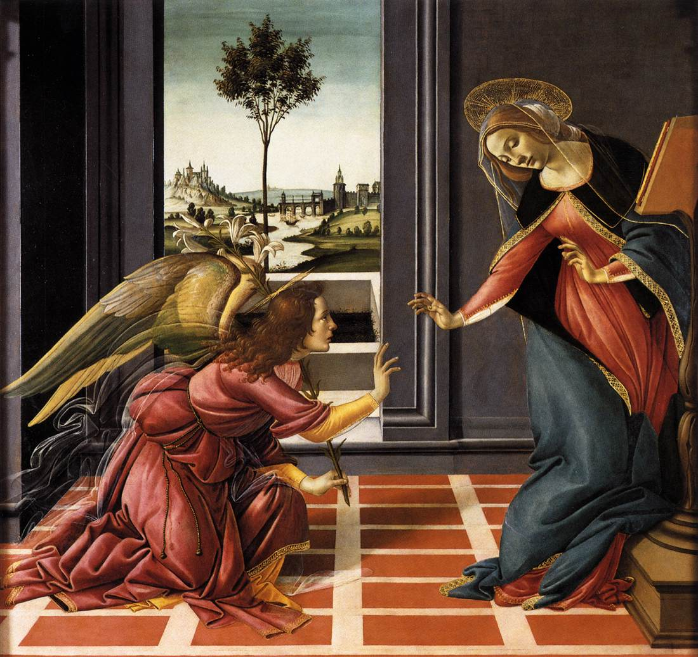

+++
title = 'Botticelli - Annunciazione di Cestello'
date = 2023-12-17T12:28:50Z
draft = false
categories = ["Cultura"]
tags = ["2023", "Botticelli", "Nuovo Testamento"]
+++

## Luca 1:26 (CEI)

> Nel sesto mese, l'angelo Gabriele fu mandato da Dio in una città della Galilea,
>
> chiamata Nazaret, a una vergine, promessa sposa di un uomo della casa di Davide,
>
> chiamato Giuseppe.
> La vergine si chiamava Maria.
>
> Entrando da lei, disse: «Ti saluto, o piena di grazia, il Signore è con te».
>
> A queste parole ella rimase turbata e si domandava che senso avesse un tale saluto.
>
> L'angelo le disse: «Non temere, Maria, perché hai trovato grazia presso Dio.
>
> Ecco concepirai un figlio, lo darai alla luce e lo chiamerai Gesù.
>
> Sarà grande e chiamato Figlio dell'Altissimo; il Signore Dio gli darà il trono
>
> di Davide suo padre e regnerà per sempre sulla casa di Giacobbe e il suo regno non avrà fine».
>
> Allora Maria disse all'angelo: «Come è possibile? Non conosco uomo».
>
> Le rispose l'angelo: «Lo Spirito Santo scenderà su di te, su te stenderà la sua ombra
>
> la potenza dell'Altissimo. Colui che nascerà sarà dunque santo e chiamato Figlio di Dio.
>
> Vedi: anche Elisabetta, tua parente, nella sua vecchiaia, ha concepito un figlio e questo
>
> è il sesto mese per lei, che tutti dicevano sterile: nulla è impossibile a Dio».
>
> Allora Maria disse: «Eccomi, sono la serva del Signore, avvenga di me quello che hai detto».
>
> E l'angelo partì da lei.
