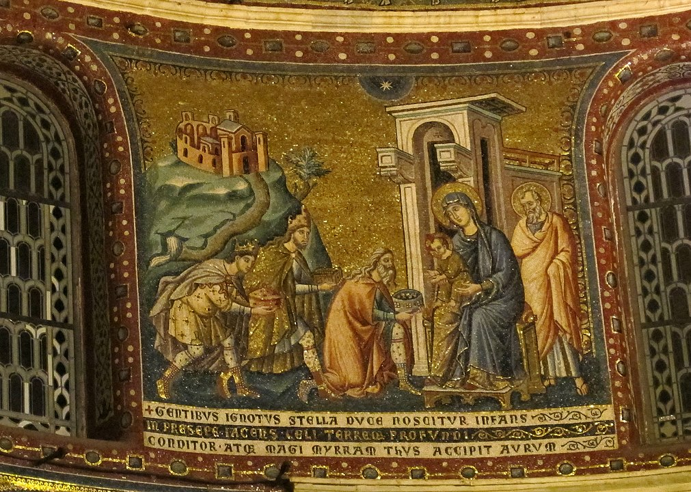

+++
title = 'Epifania, 6 gennaio'
date = 2024-01-06T13:41:50Z
draft = false
categories = ["Cultura"]
tags = ["2024", "Cavallini", "Nuovo Testamento"]
+++

"The word Epiphany is from Koine Greek ἐπιφάνεια, epipháneia, meaning manifestation or appearance.
It is derived from the verb φαίνειν, phainein, meaning "to appear". In classical Greek it was used
for the appearance of dawn, of an enemy in war, but especially of a manifestation of a deity to a
worshiper (a theophany). In the Septuagint the word is used of a manifestation of the God of Israel
(2 Maccabees 15:27). In the New Testament the word is used in 2 Timothy 1:10 to refer either to the
birth of Christ or to his appearance after his resurrection, and five times to refer to his Second Coming."
[Wikipedia](https://en.wikipedia.org/wiki/Epiphany_(holiday))

## La Befana

[Celebrating the Feast of the Epiphany in Italy](https://www.lacucinaitaliana.com/trends/news/la-befana-celebrating-the-feast-of-the-epiphany-in-italy)

## Adorazione dei magi, Trastevere, Rome

Mosaic by Pietro Cavallini (1259 – c. 1330)

GENTIBUS IGNOTUS STELLA DUCE NOSCITUR INFANS

| | | |
|------------|-----------|-----------------|
| &bull; gentibus | dative | to the peoples/nations |
| &bull; ignotus...infans | nominative | the unknown infant |
| &bull; stella duce | ablative | by means of a leading star |
| &bull; noscitur | 3rd person singular passive | is made known (noscere: gnostic, agnostic...) |

## Matteo 2:1-12 (CEI)

> Gesù nacque a Betlemme di Giudea, al tempo del re Erode.
>
> Alcuni Magi giunsero da oriente a Gerusalemme e domandavano:
>
> «Dov'è il re dei Giudei che è nato?
>
> Abbiamo visto sorgere la sua stella, e siamo venuti per adorarlo».
>
> All'udire queste parole, il re Erode restò turbato e con lui tutta Gerusalemme.
>
> Riuniti tutti i sommi sacerdoti e gli scribi del popolo,
>
> s'informava da loro sul luogo in cui doveva nascere il Messia.
>
> Gli risposero: «A Betlemme di Giudea, perché così è scritto per mezzo del profeta:
>
> E tu, Betlemme, terra di Giuda,
>
> non sei davvero il più piccolo capoluogo di Giuda:
>
> da te uscirà infatti un capo che pascerà il mio popolo, Israele».
>
> Allora Erode, chiamati segretamente i Magi, si fece dire con esattezza da loro il tempo in cui era apparsa la stella
>
> e li inviò a Betlemme esortandoli:
>
> «Andate e informatevi accuratamente del bambino e, quando l'avrete trovato,
>
> fatemelo sapere, perché anch'io venga ad adorarlo».
>
> Udite le parole del re, essi partirono.
>
> Ed ecco la stella, che avevano visto nel suo sorgere, li precedeva,
>
> finché giunse e si fermò sopra il luogo dove si trovava il bambino.
>
> Al vedere la stella, essi provarono una grandissima gioia.
>
> Entrati nella casa, videro il bambino con Maria sua madre, e prostratisi lo adorarono.
>
> Poi aprirono i loro scrigni e gli offrirono in dono oro, incenso e mirra.
>
> Avvertiti poi in sogno di non tornare da Erode, per un'altra strada fecero ritorno al loro paese.
