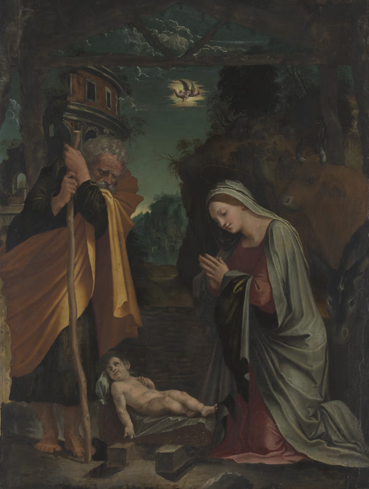

+++
title = 'Perruzi - Natività'
date = 2023-12-25T11:21:50Z
draft = false
categories = ["Cultura"]
tags = ["2023", "Peruzzi", "Nuovo Testamento"]
+++

## The Nativity, Oil on panel, Painted circa 1515

Baldassare Peruzzi (Ancaiano, nr. Siena 1481 – 1536 Rome)

"...a distinctive and original example of Roman art of the High Renaissance period, produced shortly
after the completion of Michelangelo’s Sistine Chapel ceiling and while Raphael was active in the Vatican
Stanze... the inclusion of a ruined building ... is distinctly reminiscent of the Colosseum –
an allusion to the fall of the ancient order with the birth of Christ. The Nativity also takes place in a
nocturnal setting, an artistic trope of this period, with the protagonists bathed in moonlight and the
annunciatory angel appearing in a nimbus, accentuated by the moonlit cloud formations. The manner in
which the artist combines dark tonalities with strong side lighting in order to focus on events in the
foreground was a device adopted by later artists such as Parmigianino and Rosso Fiorentino, and places
Peruzzi at the foreground of innovation in Roman painting around the mid-1510s."

[Quotation Source - Agnew's Gallery](https://www.agnewsgallery.com/attachment/en/5823a4f387aa2c572af0267a/TextOneColumnWithFile/5e7b3e5c293c115247f13a0d)

[N.I. Museum - Peruzzi's Nativity Saved](https://www.gov.uk/government/news/a-christmas-gift-for-the-nation-as-peruzzis-the-nativity-saved)

## Luca 2:1-19 (CEI)

> In quei giorni un decreto di Cesare Augusto ordinò che si facesse il censimento di tutta la terra.
>
> Questo primo censimento fu fatto quando era governatore della Siria Quirinio.
>
> Andavano tutti a farsi registrare, ciascuno nella sua città.
>
> Anche Giuseppe, che era della casa e della famiglia di Davide, dalla città di Nazaret
>
> e dalla Galilea salì in Giudea alla città di Davide, chiamata Betlemme,
>
> per farsi registrare insieme con Maria sua sposa, che era incinta.
>
> Ora, mentre si trovavano in quel luogo, si compirono per lei i giorni del parto.
>
> Diede alla luce il suo figlio primogenito, lo avvolse in fasce e lo depose in una mangiatoia,
>
> perché non c'era posto per loro nell'albergo.
>
> C'erano in quella regione alcuni pastori che vegliavano di notte facendo la guardia al loro gregge.
>
> Un angelo del Signore si presentò davanti a loro e la gloria del Signore li avvolse di luce.
>
> Essi furono presi da grande spavento, ma l'angelo disse loro:
>
> «Non temete, ecco vi annunzio una grande gioia, che sarà di tutto il popolo:
>
> oggi vi è nato nella città di Davide un salvatore, che è il Cristo Signore.
>
> Questo per voi il segno: troverete un bambino avvolto in fasce, che giace in una mangiatoia».
>
> E subito apparve con l'angelo una moltitudine dell'esercito celeste che lodava Dio e diceva:
>
> «Gloria a Dio nel più alto dei cieli e pace in terra agli uomini che egli ama».
>
> Appena gli angeli si furono allontanati per tornare al cielo, i pastori dicevano fra loro:
>
> «Andiamo fino a Betlemme, vediamo questo avvenimento che il Signore ci ha fatto conoscere».
>
> Andarono dunque senz'indugio e trovarono Maria e Giuseppe e il bambino, che giaceva nella mangiatoia.
>
> E dopo averlo visto, riferirono ciò che del bambino era stato detto loro.
>
> Tutti quelli che udirono, si stupirono delle cose che i pastori dicevano.
>
> Maria, da parte sua, serbava tutte queste cose meditandole nel suo cuore.
