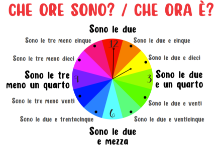

+++
title = 'Italian Beginners A104'
date = 2024-01-31T09:53:00Z
draft = false
categories = ["Lezioni"]
tags = ["A1", "Giada", "2024"]
+++

## Bentornati

- Mercoledì 31 gennaio duemilaventiquattro
- Che tempo fa oggi?
- C’è Vento
- C’è il sole
- Piove
- Nevica
- Fa brutto vs fa bello

## Le Ore del Giorno

## Focus sui verbi

- [-are] parlo, parli, parla, parliamo, parlate, parlono
- [-ere] vedo, vedi, vede, vediamo, vedete, vedono
- [-ire] sento, senti, sente, sentiamo, sentite, sentono

## Avete visto cosa succede con i verbi in –IRE?

Osserviamo le terminazioni!

1. Take the INFINITIVE
2. Drop the ending –IRE
3. Add the ending that you need: -o, -i, **-e**, -iamo, **-ite**, **-ono**

## Verbi in -ere (italianoinonda.net)

- Io prendo il treno alle sette.
- Noi corriamo tutti i giorni.
- Tu leggi molti libri?
- Voi vedete la partita stasera?
- A che ora chiude questo negozio?
- I ragazzi scrivono molti messaggi.

## Verbi in -ire (italianoinonda.net)

- Io sento spesso le notizie alla radio
- Noi seguiamo questo sentiero, e voi?
- Dormi o sei sveglio?
- Voi partite domani?
- A che ora apre questo negozio?
- I miei amici offrono da bere a tutti.

## Verbi molto comuni in -ire

- regolari: dormire, sentire,  partire, aprire
- irregolari: dire, salire, uscire, venire
- irregolari (-isc-): preferire, capire

## Esempio

- Quante ore dormi al giorno?
- Sento una musica meravigliosa. Credo che sia Paolo Conte…
- Parto per Girona domani mattina
- A che ora aprono i negozi?
- Scusa, ma non capisco. Puoi ripetere, per favore?
- Scusa, ma non capisco cosa dici. Puoi ripetere, per favore?
- Irene sale le scale per arrivare alla cattedrale.
- Non possiamo uscire in questo momento.
- Vieni a casa mia? Non vengo a casa tua, non ho voglia di uscire…

## L’articolo determinativo

- il brocolo
- la carota
- il cavolo
- l'asparago
- il carciofo
- il cavolfiore
- il peperone
