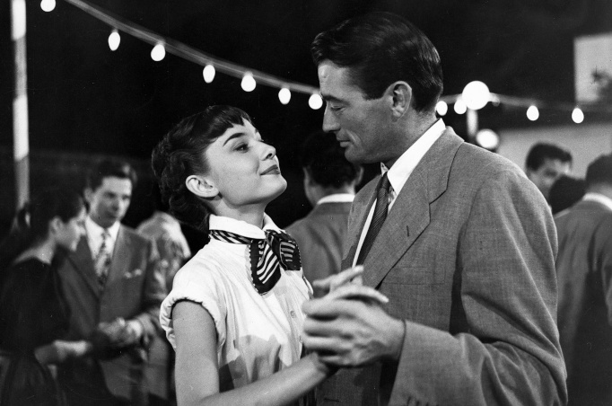

+++
title = 'Italian Beginners A107'
date = 2024-02-28T17:39:00Z
draft = false
categories = ["Lezioni"]
tags = ["A1", "Giada", "2024"]
+++

## Bentornati

- Che giorno è oggi? 28 febbraio 2024
- Anno bisestile *leap year*

## C'è tempo fa?

- Fa caldo
- Fa freddo
- C'è vento
- C'è il sole
- La nuvola. È nuvoloso.
- È variabile
- Non è soleggiato.
- Il cielo è coperto/nuvoloso.
- vs. Il cielo è sereno, limpido, terso.

## Shortened words

- la bici (bicicletta)
- la moto (motocicletta)
- la foto (fotografia)
- il cinema (cinematografo)

## L’articolo DETERMINATIVO

### Esercizio 1

- la lavatrice nuova
- gli occhiali da sole
- il vestito di Armani
- il casco *helmet*
- l'appartamento in centro
- la bicicletta nuova
- lo zaino Invicta
- gli stivali di Dolce e Gabbana
- l'orologio
- la borsa di Gucci
- il computer portatile
- l'automobile elettrica
- i biglietti per La Scala
- le scarpe di Ferragamo

### Esercizio 2

- La mattina beve il caffellatte
- Legge il giornale
- Mangia i biscotti
- Prende la valigetta
- Bacia la moglie
- Saluta la famiglia
- Compra il biglietto
- Prende l'autobus

### Esercizio 3

- Tutti i stranieri conoscono Roma, la capitale d'Italia.
- I turisti di solito visitano i monumenti famosi, come il Colosseo, il Foro Romano e la Basilica di San Pietro.
- Oppure vanno a vedere le piazze più belle, come Piazza di Spagna, con la scalinata di Trinità dei Monti,
- o Piazza Navona, con la bellissima fontana del Bernini.
- A roma però ci sono anche molte cose da fare di notte.
- La notte romana è vivace e divertente, i ristoranti sono ottimi, le osterie sono piene, i bar sono aperti fino a tardi.
- Dopo la cena i romani vanno a ballare, le discoteche del centro sono molto frequentate.
- E per chi rimane fuori tutta la notte, è normale fare la colazione al bar con i amici prima di andare a casa.

### Esercizio 4

- A colazione molti bevono soltanto il caffè al bar, in piedi al bancone. Vero.
- Dopo pranzo molti bevono il cappuccino. Falso.
- Prima di pranzo tutti bevono l'amaro. Falso.
- A Natale e Capodanno è normale bere lo spumante. Vero.
- Per primo è normale mangiare l'insalata. Falso.
- A colazione molti mangiano lo zupa di pesce.
- Alle ore 17 molti bambini fanno la merenda. Vero.
- È normale bere il latte a pranzo. Falso.
- Normalmente gli italiani bevono la birra con la pizza. Vero.
- Per aperitivo molti bevono il prosecco o lo spumante. Vero.
- Molti italiani mangiano gli spaghetti. Vero.
- Con il pesce gli italiani bevono il vino rosso. Falso.

## Vocabolario

- oppure *or*
- però *but, however*
- avvocato *lawyer*
- ingegnere *engineer*
- parrucchiera *hairdresser*
- calciatore *footballer*
